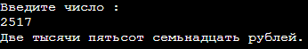

#Lab2
## Операторы выбора if и else
_____
### Описание программы
Пользователь вводит число от 1 до 9999. Программа выводит на экран сумму словами, и в конце дописывает название валюты (рубль) с правильным окночанием.
Например: Например: 7431 – Семь тысяч четыреста тридцать один рубль, 2149 – две тысячи сто сорок девять рублей, 15 – Пятнадцать рублей, 3 – Три рубля.
:white_check_mark: Задание со *(звездочкой) выполнено. Первое слово печатается с большой буквы.
_____
### Скриншот выходных данных

_____
### Среда разработки
Программа написана на языке С++. Программу можно запустить через онлайн-компилятор [OnlineJBD](https://onlinegdb.com/saCHNUhHP)
